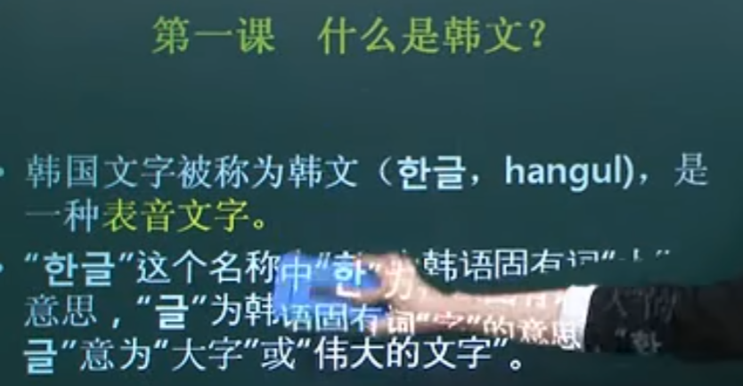
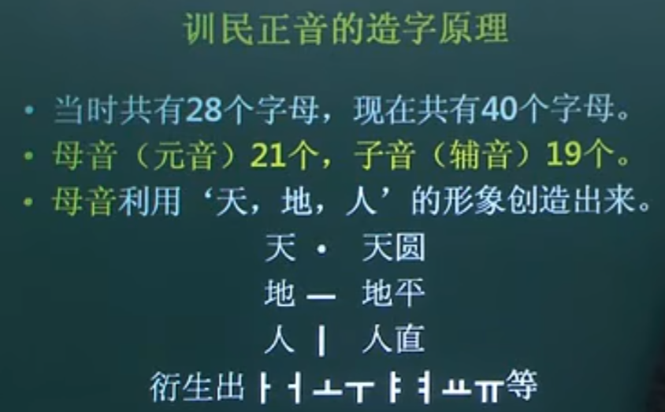
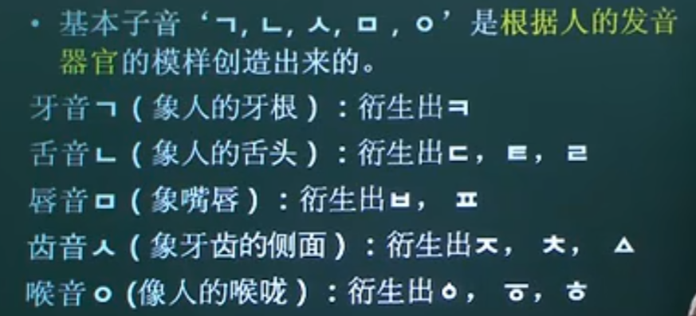
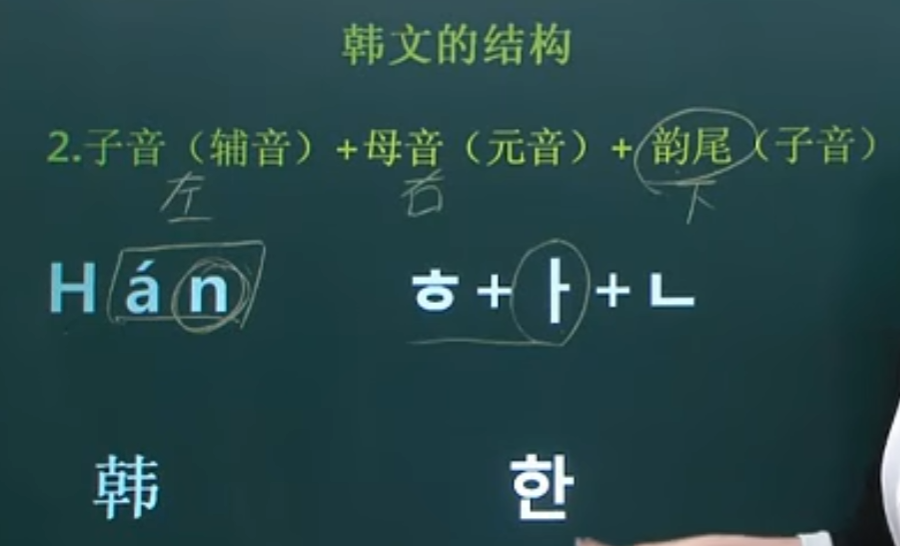
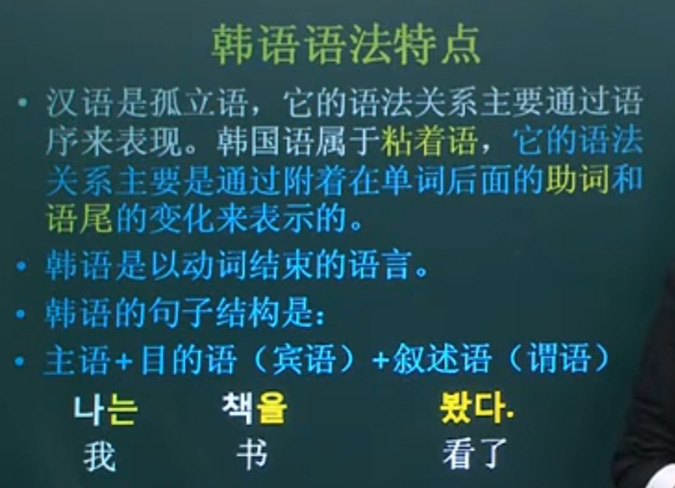

# 1. 韩文是表音文字

表音文字就是可以直接读出来的文字， 看到就可以读

# 2. 韩语的造字原理

# 3. 韩语子音的发音规律

根据发音器官的模样画出来的， 这样发音就不会出现大错

https://www.bilibili.com/video/BV1w4411e7Bz?t=947.5

# 4. 韩文结构

# 5. 韩语语法特点

粘着语， 其实就是靠助词去标记的成分

