# 1. 单韵尾ㄱ ㄴ ㄷ ㄹ ㅁ ㅂ ㅇ7类

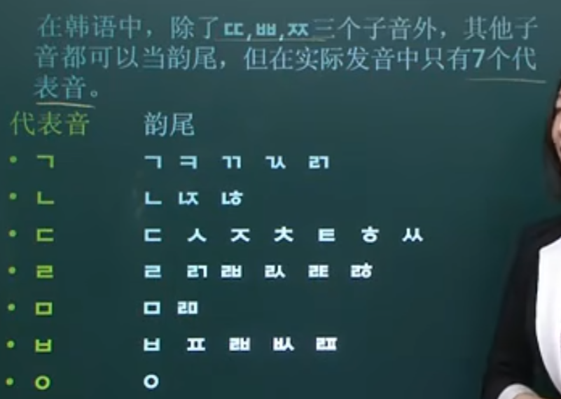

## 1. ㄱ k

舌根顶着软腭处位置， 舌尖快速朝下， 把气流截断， 即把之前正常的长音截断成短音

## 2. ㄴ n

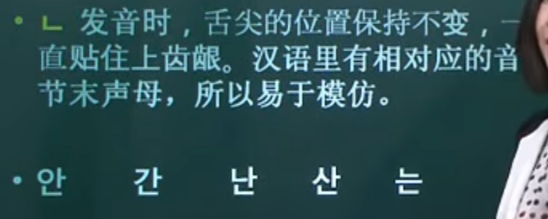

## 3. ㄷ 短舌尖的感觉

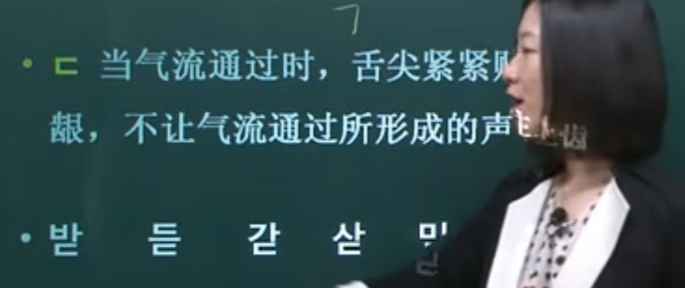

舌尖出来一点， 截断在舌尖的感觉

## 4. ㄹ r

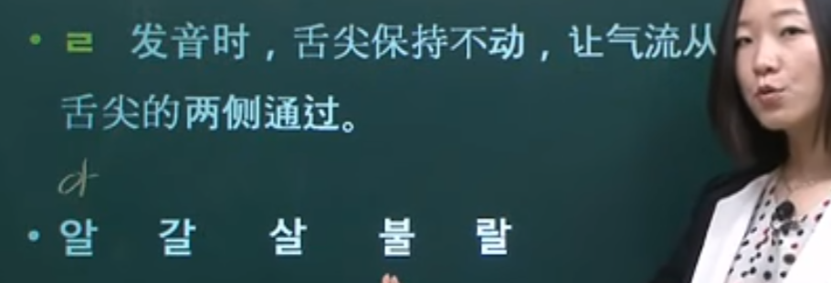

## 5. ㅁ m

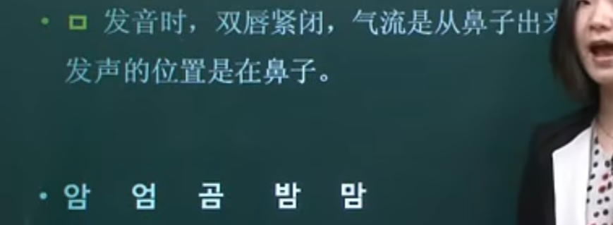

## 6. ㅂ b

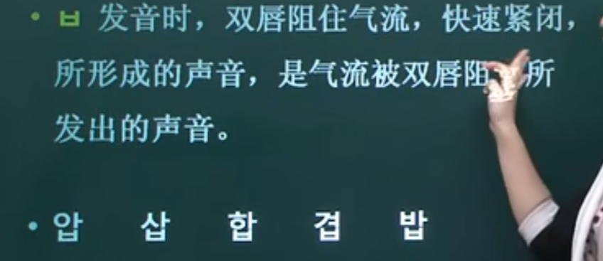

## 7. ㅇng

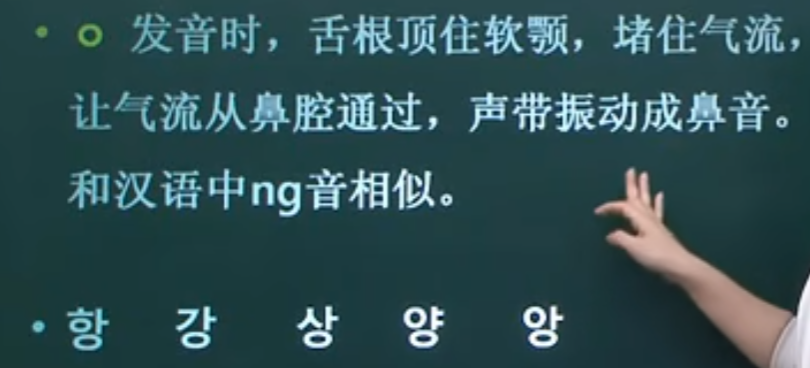

# 2. 单韵尾（9个）

## 1. ㄷ,ㅅ,ㅆ,ㅈ,ㅊ,ㅌ,ㅎ 短舌尖的感觉

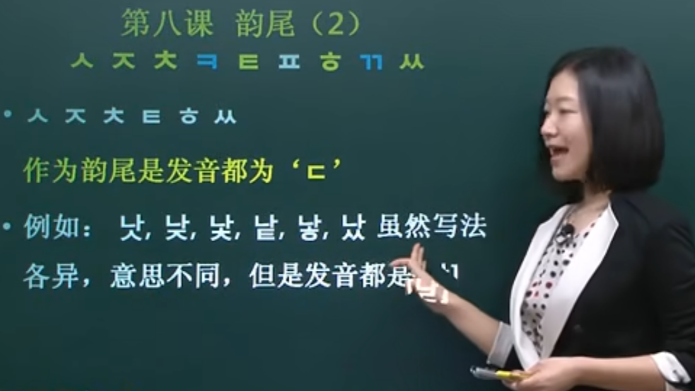

## 2. ㄲ, ㅋ k

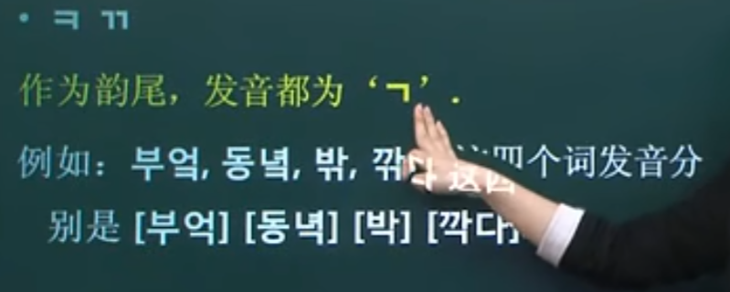

## 3. ㅍb

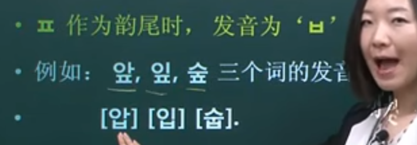

# 3. 双韵尾（发音左边）

## 0. 注意总体的事项

### 1. 一个你能立刻用的“判断口诀”

**“받침是 ㄱ/ㄷ/ㅂ 才最爱顶紧后面的平音”**
 鼻音（ㄴ/ㅁ/ㅇ）和 ㄹ，**很多时候不会把借过去的首音逼成紧音**（尤其是像你这类 ㄴ + ㅈ 的连音环境）。

------

#### 你这里发生的是：**连音（把 ㄵ 的右边 ㅈ 借过去）**，但**不触发“紧音化”**

- **앉아**：앉(ㄵ) + 아
   ㄵ 的左边 ㄴ 留在前一音节当韵尾，右边 **ㅈ 借到下一音节当首音**
   → **안 + 자 = [안자]**
- **얹어**：얹(ㄵ) + 어
   同理右边 ㅈ 借过去
   → **언 + 저 = [언저]**

------

#### 为什么不像 값에[갑쎄]、없어[업써] 那样变紧音？

因为那种“变紧音(된소리되기)”最典型、最稳定的触发环境是：

> **前面有“闭塞音 받침”（ㄱ/ㄷ/ㅂ 等） + 后面是平音（ㄱㄷㅂㅅㅈ）开头**

例如：

- 업(ㅂ받침) + 서(ㅅ) → 업써
- 갑(ㅂ받침) + 세(ㅅ) → 갑쎄

但你这个 **안자 / 언저** 的前一音节韵尾是 **ㄴ（鼻音 받침）**，不是 ㄱ/ㄷ/ㅂ 那种“闭塞音”。
 **ㄴ 不属于最强、最稳定触发紧音化的那一类 받침**，所以后面的 **ㅈ** 一般就按普通 [ㅈ] 读，而不是 [ㅉ]。

换句话说：

- **값에 / 없어**：前面是 **ㅂ 받침**（强触发）→ ㅅ 很容易变 **ㅆ**
- **앉아 / 얹어**：前面是 **ㄴ 받침**（不属于常规强触发）→ ㅈ 通常不变 **ㅉ**

### 2. 你要的“总规则”一句话版

**借过去以后会不会变紧音，看两点：**

1. **被紧音化的目标必须是“平音”**（ㄱ ㄷ ㅂ ㅅ ㅈ）
   - 所以 **ㅌ（送气音）借过去不会变**：할타、훌터
2. 你这些图里，**“右边是 ㅅ 的 겹받침”是最爱变 ㅆ 的一类**
   - ㄽ/ㅄ 这类借出 ㅅ → 很常标成 ㅆ：갑쎄、업써、골쓸、골쓰로
   - 但 **ㄵ 借出 ㅈ** → 通常就读 ㅈ：안자、언저

### ==3. 连音现象（重点）==

你的直觉是对的：**“连音(연음)”本身不会额外制造紧音(된소리)**。
 老师笔记里没标紧音，通常是因为他讲的是**纯连音规则**：把前一个音节的 받침（韵尾）移到后一个以 **ㅇ+元音** 开头的音节去读——到这里就结束了。

下面把你问的点讲清楚：**单韵尾 + 连音以后，到底会不会“变紧音”？**

------

#### 1）结论先说：一般“不需要变紧音”

##### ✅ 典型连音（不紧音）

- 한국어 → **[한구거]**（ㄱ移过去读“구”，不是“꾸”）
- 밤에 → **[바메]**（ㅁ移过去读“메”，不涉及紧音）
- 책이 → **[채기]**（ㄱ移过去读“기”，不是“끼”）
- 옷이 → **[오시]**（ㅅ移过去读“시”，不是“씨”）

> 这类结构的本质是：后面本来没有辅音（是“ㅇ”空位），所以不存在“把后面辅音顶成紧音”的对象。
>  你只是把前面那个辅音“搬家”过去当首音而已。

------

#### 2）你可能误会的地方：有时“听起来很硬”，但不是紧音

比如 **책이 [채기]**，很多初学者会觉得像“채끼”，原因是：

- 받침的 ㄱ 在词末是“塞住不放”的 [k̚]（很短很硬）
- 但**一旦连音到元音前**，它就按首音读成 **ㄱ 的普通首音**（介于g/k之间的那种），**不是 ㄲ**。

所以：**“硬/短” ≠ 紧音(ㄲㄸㅃㅆㅉ)**。

------

#### 3）什么时候你会在“连音后”看到紧音？只有一种：它本来就是紧音字母

这点非常关键：
 连音后“变成紧音”的情况，很多其实不是“变出来的”，而是**这个 받침字母本身就是 ㄲ/ㅆ 等紧音**，连音只是把它搬过去，它当然还保持紧音。

##### ✅ 例子：本来就是紧音 받침 → 连音后仍是紧音

- 밖에（밖 + 에）→ **[바께]**
   밖的 받침写的是 **ㄲ**，搬到“에”前面当然读 ㄲ（께）
- 있어（있 + 어）→ **[이써]**
   있的 받침写的是 **ㅆ**，连音后读 ㅆ（써）

> 这种“紧音”不是连音触发的，而是**字就写成紧音**。

------

#### 4）对比一下：真正“会触发紧音”的，通常不是连音，而是后面“本来有辅音”的情况

你之所以在别处学到“会变紧音”，常见环境是：

- 먹다 → [먹따]（ㄱ 받침 + ㄷ → ㄸ）
- 없다 → [업따]（ㅂ 받침 + ㄷ → ㄸ）
- 값도 → [갑또]（ㅂ 받침 + ㄷ → ㄸ）

这里是 **받침 +（后面原本就有的）平音辅音**，才会“顶紧”变紧音。
 但你问的连音例子是 **받침 + ㅇ+元音**，**后面没有辅音可被顶紧**，所以通常不出现这类紧音化。

------

#### 5) 一句话记忆法

- **连音(받침 + ㅇ+元音)：只搬家，不额外变紧音。**
- **你看到/听到紧音，多半是：**
  1. **那个字母本来就是 ㄲ/ㅆ**（如 밖에[바께], 있어[이써]），或
  2. **后面本来有辅音**（如 먹다[먹따]），不是连音那类结构。

### 4. 补充理解到底什么时候需要变紧音？

你这套理解已经很接近了，但我帮你把**关键点纠正到“完全正确”**：

> **会不会紧音，核心不是“单韵尾/双韵尾”，而是：
>  （A）后面是不是本来有辅音可以被“顶紧”；
>  （B）被连过去的那个辅音是什么；
>  （C）那个辅音本来是不是紧音字母。**

下面我按你说的两句分别补充、修正，并给你一套**可直接套用的判断规则**。

------

#### 1）“单韵尾 + ㅇ+元音，一般很少变紧音” ✅基本正确

像这些都是**纯连音**，通常不紧音：

- 책이 → [채기]（ㄱ移过去）
- 한국어 → [한구거]
- 밤에 → [바메]
- 꽃이 → [꼬치]（注意：这里不是“变紧音”，而是 ㅊ 连过去就是 ㅊ）

##### 为什么不紧音？

因为后面是 **ㅇ（空首音）+元音**，**没有一个“原本存在的平音辅音”让你去顶紧**。
 连音只是“搬家”，通常不会把搬过去的 ㄱ/ㄷ/ㅂ 自动变成 ㄲ/ㄸ/ㅃ。

✅ 所以你可以记：
 **받침 + ㅇV（元音）= 主要就是连音，不额外紧音。**

------

#### 2）“双韵尾 ㄱ/ㄷ/ㅂ + ㅇ+元音，经常要变紧音” ❌这句需要改写

你在前面看到的“经常变紧音”，其实**多发生在：双韵尾右边是 ㅅ/ㅆ 时**，而不是“左边是 ㄱ/ㄷ/ㅂ”。

##### 2.1 双韵尾里“容易让你看到 ㅆ”的典型：**右边是 ㅅ**

比如你之前学到的：

- 없 + 어 → 없어 **[업써]**
- 값 + 에 → 값에 **[갑쎄]**
- 곬 + 을 → 곬을 **[골쓸]**（ㄽ 的 ㅅ连过去）

它们共同点是：**겹받침里有 ㅅ（或写出来连过去表现成 ㅅ）**，连到下一音节后常出现 **ㅆ**。

> 但注意：这不是因为“左边是 ㅂ/ㄱ/ㄷ”，而是因为“连过去的是 ㅅ”，再加上前面音节有收束感（常常是塞音或某些环境），口语里很自然读成 ㅆ。

##### 2.2 反例：双韵尾也很多“不变紧音”

- ㄾ：핥아 → [할타]（ㅌ连过去，不会变 ㄸ）
- ㄵ：앉아 → [안자]（ㅈ连过去，不会变 ㅉ）
- ㄺ：읽어 → [일거]（ㄱ连过去，一般不变 ㄲ）
- ㄻ：삶이 → [살미]（ㅁ连过去，不可能变紧音）

✅ 所以“双韵尾 + ㅇ+元音 ≠ 经常紧音”。
 “经常紧音”的，只是一部分双韵尾类型（尤其含 **ㅅ** 的）。

------

#### 3）你真正可以“一步判定”的规则（最实用）

##### 第一步：看后面是不是 **ㅇ+元音**

- 如果是 **ㅇ+元音**：先想“**这是连音**”，默认**不紧音**
   ✅ 밤에 [바메] / 책이 [채기] / 읽어 [일거]

##### 第二步：只有两种情况下你会“听到/标记成紧音”

**情况A：连过去的那个字母本身就是紧音字母**

- 밖에：받침是 ㄲ，本来就紧 → [바께]
- 있어：받침是 ㅆ，本来就紧 → [이써]

**情况B：连过去的是 ㅅ（或会实现为 ㅅ），常见口语会读成 ㅆ**

- 없어 [업써]
- 값에 [갑쎄]
- 곬을 [골쓸] / 외곬으로 [외골쓰로]

> 这类是你课上最容易看到“借过去还写成 ㅆ”的来源。

------

#### 4）把你的原话“改成完全正确版本”

你可以这样总结（非常标准、也适合做笔记）：

1. **单韵尾 + ㅇ+元音：基本是连音，通常不发生紧音化。**
2. **双韵尾 + ㅇ+元音：也主要是连音；是否出现紧音要看“连过去的辅音是什么”。**
   - 若连过去的是 **ㅅ/ㅆ（或本来就是 ㄲ/ㅆ）**，常会表现为 **ㅆ/ㄲ**；
   - 若连过去的是 **ㅈ/ㅌ/ㄱ/ㅁ…**，一般不变紧音（按原辅音读）。

## 1. ㄳ = ㄱ+ㅅ → **[ㄱ]**

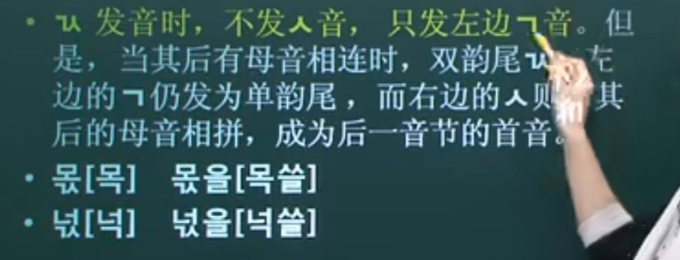'

## 2. ㅄ = ㅂ+ㅅ → **[ㅂ]**

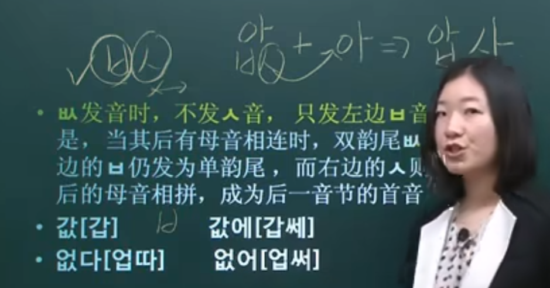

## 3. ㄵ = ㄴ+ㅈ → **[ㄴ]**

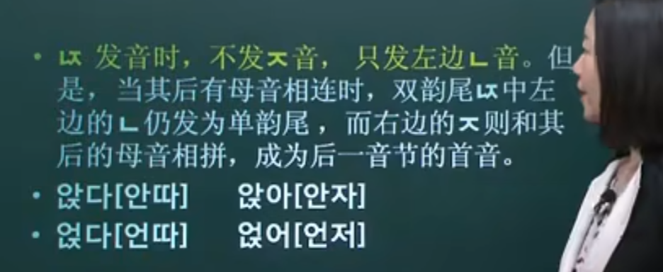

## 4. ㄽ = ㄹ+ㅅ → **[ㄹ]**

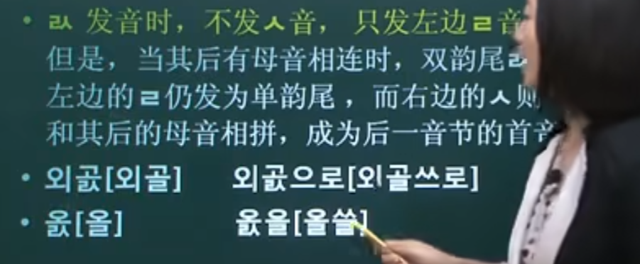

## 5. ㄾ = ㄹ+ㅌ → **[ㄹ]**

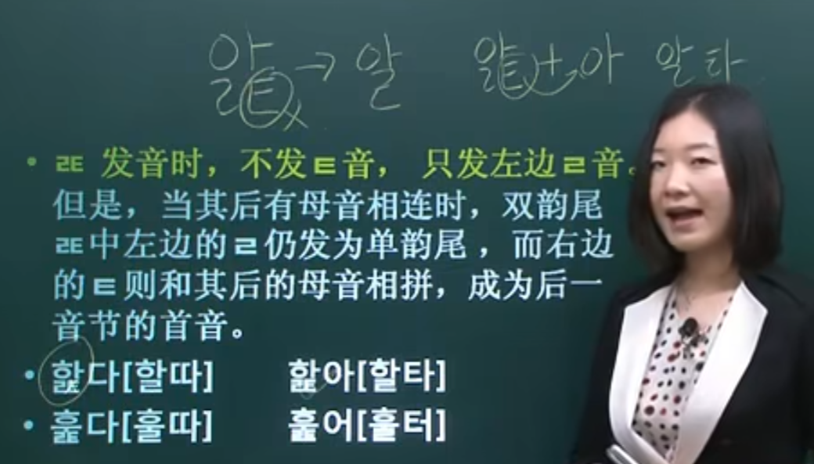

# 4. 双韵尾（右边）

**注意如果和母音相连的时候， 特殊在把最近的给右边， 所以发音会变化**

## 1. ㄻ = ㄹ+ㅁ → **[ㅁ]**

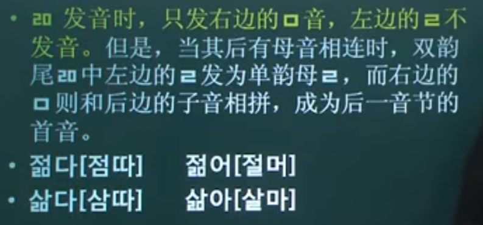

## 2. ㄺ = ㄹ+ㄱ → **通常 [ㄱ]**

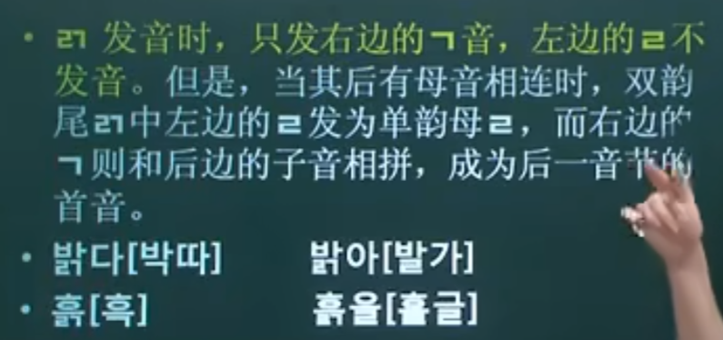

### **特殊情况：**

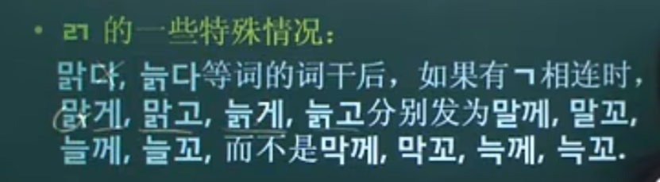

## 3. ㄼ = ㄹ+ㅂ

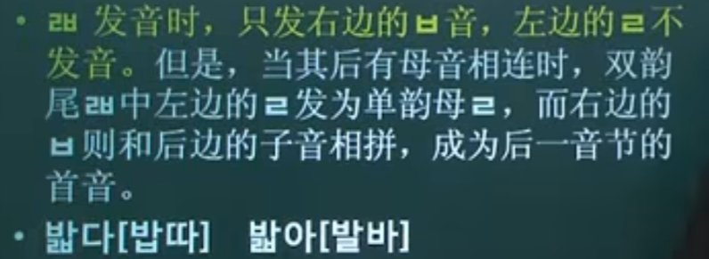

### 特殊情况:

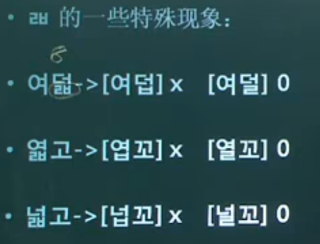

## 4. ㄿ = ㄹ+ㅍ

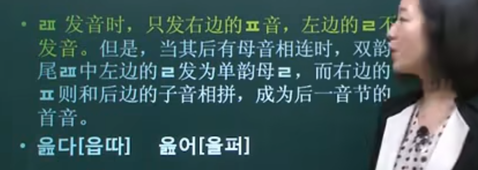

## 5. ㄶ = ㄴ+ㅎ → **[ㄴ]**、ㅀ = ㄹ+ㅎ → **[ㄹ]**

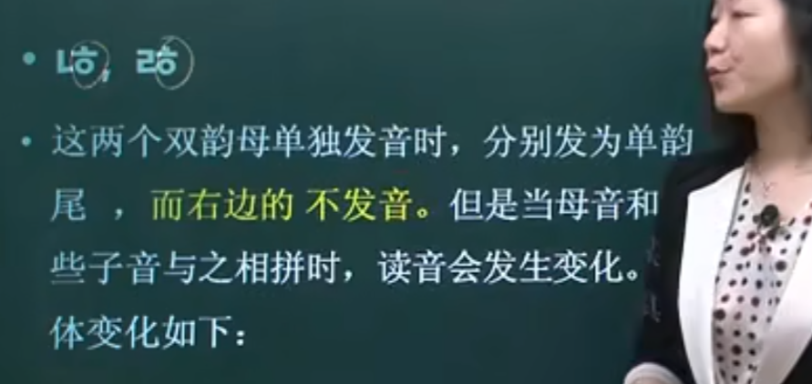

### 特殊情况：

#### 1、 平音变送气音

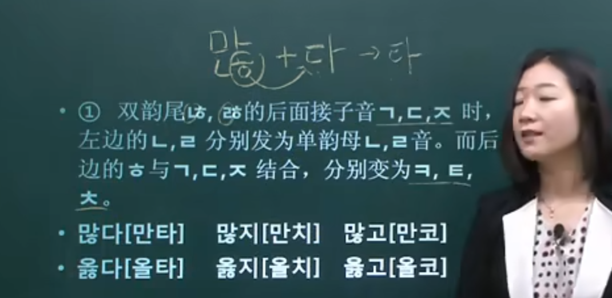

#### 2、 松音变紧音

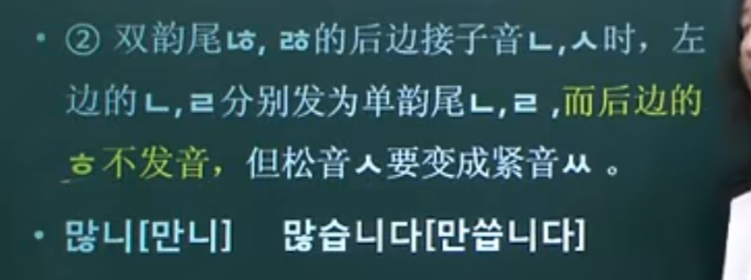

#### 3、母音相连只发

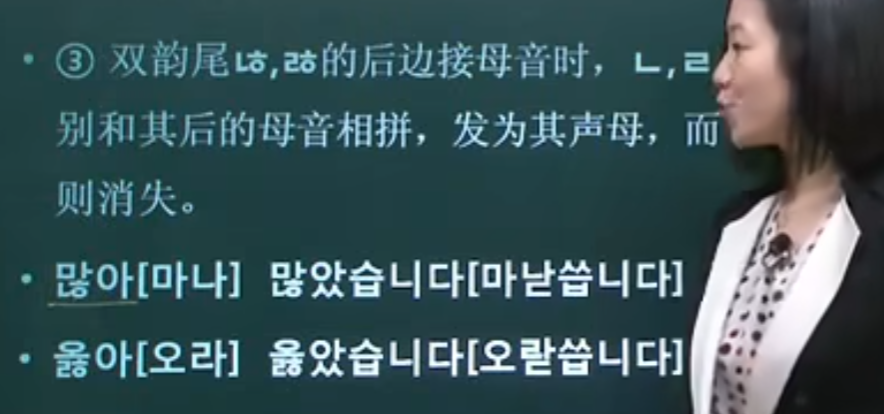
